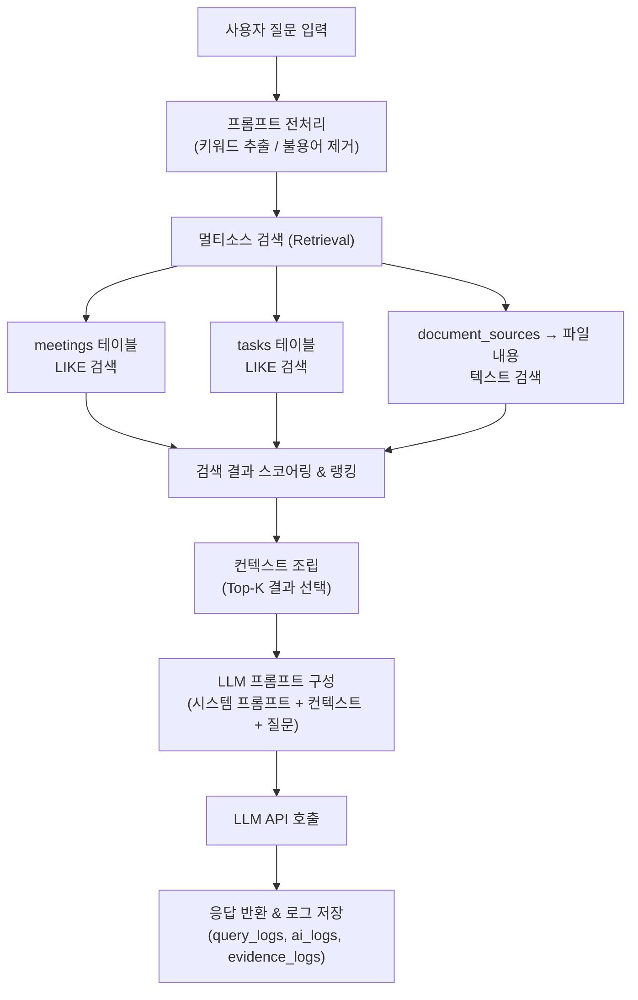
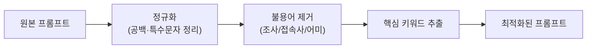

# RAG 구현 계획 & 프롬프트 최적화 전략

## 목차
1. [RAG (검색 증강 생성) 구현 계획](#1-rag-검색-증강-생성-구현-계획)
2. [프롬프트 최적화 & 토큰 절감 전략](#2-프롬프트-최적화--토큰-절감-전략)

---

## 1. RAG (검색 증강 생성) 구현 계획

### 1.1 현재 프로젝트 구조 분석

현재 DB에 이미 RAG를 위한 기반이 잘 갖춰져 있습니다:

| 테이블 | RAG에서의 역할 | 핵심 필드 |
|--------|---------------|-----------|
| `meetings` | 회의록 검색 소스 | `title`, `content`, `summary` |
| `tasks` | 태스크 검색 소스 | `title`, `description`, `status`, `tags` |
| `document_sources` | 문서 메타데이터 | `file_path`, `file_name`, `file_type` |
| `evidence_logs` | 검색 결과 스냅샷 저장 | `source`, `title`, `content`, `score` |
| `query_logs` | 질의 이력 관리 | `prompt`, `response`, `sources` |
| `ai_logs` | LLM 호출 기록 | `prompt_sent`, `raw_response`, `token_used` |

### 1.2 RAG 파이프라인 아키텍처



### 1.3 구현 방식: 2가지 옵션

#### 옵션 A: SQL 기반 키워드 검색 (추천 — 경량, 즉시 적용 가능)

외부 벡터 DB 없이 기존 SQLite만으로 구현합니다.

```typescript
// src/main/services/ragService.ts — 핵심 구조

interface RetrievalResult {
  source: 'meeting' | 'task' | 'document'
  id: number
  title: string
  content: string
  score: number  // 관련도 점수
}

async function retrieve(projectId: number, keywords: string[]): Promise<RetrievalResult[]> {
  const results: RetrievalResult[] = []

  // 1) 회의록 검색
  for (const kw of keywords) {
    const meetings = meetingRepository.search(projectId, kw)
    meetings.forEach(m => results.push({
      source: 'meeting',
      id: m.id as number,
      title: m.title as string,
      content: `${m.title}\n${m.summary || m.content}`,
      score: calculateScore(kw, m)
    }))
  }

  // 2) 태스크 검색 — 유사한 방식
  // 3) 문서 내용 검색 — file_path로 파일 읽어서 검색

  // 중복 제거 & 점수 합산 후 상위 K개 반환
  return deduplicateAndRank(results, TOP_K)
}
```

**스코어링 로직 예시:**
- 제목 매칭: +3점
- 본문 매칭: +1점 (매칭 횟수 × 0.5 추가)
- 최신 문서 보너스: 7일 이내 +2점
- 태스크 상태 `in_progress`: +1점 (현재 활성 작업 우대)

#### 옵션 B: 벡터 임베딩 기반 시맨틱 검색 (고급)

임베딩 모델을 사용하여 의미 기반 검색을 수행합니다.

| 항목 | 설명 |
|------|------|
| 임베딩 모델 | OpenAI `text-embedding-3-small` 또는 로컬 `all-MiniLM-L6-v2` |
| 벡터 저장 | SQLite에 BLOB으로 저장하거나 별도 파일 |
| 유사도 계산 | 코사인 유사도 (JS로 직접 계산) |

> [!TIP]
> **추천: 옵션 A로 시작 → 나중에 옵션 B로 확장**
> 옵션 A만으로도 키워드 기반 RAG는 충분히 동작합니다. 시맨틱 검색이 필요해지면 임베딩 컬럼을 마이그레이션으로 추가하면 됩니다.

### 1.4 DB 스키마 확장 (마이그레이션)

RAG 성능 향상을 위해 SQLite FTS5(Full-Text Search)를 추가합니다:

```typescript
// migrations.ts에 추가할 마이그레이션
{
  version: 'V002',
  description: 'FTS5 전문 검색 테이블 추가',
  up: (db) => {
    // 회의록 전문 검색 인덱스
    db.run(`
      CREATE VIRTUAL TABLE IF NOT EXISTS meetings_fts 
      USING fts5(title, content, summary, content=meetings, content_rowid=id)
    `)
    // 태스크 전문 검색 인덱스
    db.run(`
      CREATE VIRTUAL TABLE IF NOT EXISTS tasks_fts 
      USING fts5(title, description, content=tasks, content_rowid=id)
    `)
    // 문서 내용 캐시 + 전문 검색
    db.run(`
      CREATE TABLE IF NOT EXISTS document_contents (
        id INTEGER PRIMARY KEY,
        document_id INTEGER NOT NULL,
        content TEXT NOT NULL,
        chunk_index INTEGER DEFAULT 0,
        FOREIGN KEY (document_id) REFERENCES document_sources(id) ON DELETE CASCADE
      )
    `)
    db.run(`
      CREATE VIRTUAL TABLE IF NOT EXISTS documents_fts 
      USING fts5(content, content=document_contents, content_rowid=id)
    `)
  }
}
```

### 1.5 RAG 서비스 전체 흐름

```typescript
// ragService.ts — 메인 함수
export async function queryWithRAG(projectId: number, userQuestion: string) {
  const startTime = Date.now()

  // Step 1: 프롬프트 전처리 (섹션 2 참고)
  const { keywords, cleanedQuery } = preprocessPrompt(userQuestion)

  // Step 2: 쿼리 로그 생성
  const queryLogId = queryLogRepository.create({
    projectId, sources: 'meetings,tasks,documents',
    tool: 'rag', prompt: userQuestion
  })

  // Step 3: 멀티소스 검색
  const evidence = await retrieve(projectId, keywords)

  // Step 4: Evidence 로그 저장
  evidenceLogRepository.createBatch(
    evidence.map(e => ({
      queryLogId, source: e.source,
      title: e.title, content: e.content, score: e.score
    }))
  )

  // Step 5: LLM 프롬프트 조립
  const contextBlock = evidence
    .slice(0, 5)  // Top 5
    .map((e, i) => `[${i+1}] (${e.source}) ${e.title}\n${truncate(e.content, 500)}`)
    .join('\n---\n')

  const systemPrompt = `당신은 프로젝트 관리 AI 어시스턴트입니다.
아래 프로젝트 자료를 참고하여 질문에 답변하세요.
자료에 없는 내용은 추측하지 마세요.`

  const finalPrompt = `${systemPrompt}\n\n## 참고 자료\n${contextBlock}\n\n## 질문\n${cleanedQuery}`

  // Step 6: LLM 호출 (동료가 구현할 부분)
  const llmResponse = await callLLM(finalPrompt)

  // Step 7: 로그 저장
  const duration = Date.now() - startTime
  queryLogRepository.updateStatus(queryLogId, 'done', llmResponse.text, duration)
  aiLogRepository.create({
    queryLogId, model: llmResponse.model,
    promptSent: finalPrompt, rawResponse: llmResponse.text,
    tokenUsed: llmResponse.tokenUsed
  })

  return { answer: llmResponse.text, evidence, queryLogId }
}
```

### 1.6 파일 구조

```
src/main/services/
├── ragService.ts          # RAG 파이프라인 메인
├── retrievalService.ts    # 검색 로직 (DB 쿼리)
├── promptBuilder.ts       # 프롬프트 조립
├── promptPreprocessor.ts  # 전처리 (키워드 추출, 불용어 제거)
└── gitService.ts          # (기존)
```

---

## 2. 프롬프트 최적화 & 토큰 절감 전략

### 2.1 한국어 전처리 파이프라인



### 2.2 불용어(Stopword) 사전 & 제거

한국어 조사, 접속사, 어미 등을 정의하여 제거합니다:

```typescript
// src/main/services/promptPreprocessor.ts

// 한국어 불용어 사전
const STOPWORDS = new Set([
  // 조사
  '은', '는', '이', '가', '을', '를', '의', '에', '에서', '으로', '로',
  '와', '과', '도', '만', '까지', '부터', '에게', '한테', '께',
  // 접속사/부사
  '그리고', '그러나', '그래서', '하지만', '또한', '또는', '즉',
  '그런데', '따라서', '그러므로', '왜냐하면', '만약', '비록',
  // 동사 어미 / 보조
  '있다', '없다', '하다', '되다', '이다', '것', '수', '등', '때문',
  '위해', '통해', '대해', '있는', '없는', '하는', '되는', '했다',
  // 일반 불용어
  '좀', '잘', '매우', '정말', '아주', '너무', '꽤', '약간',
  '어떻게', '무엇', '어디', '언제', '왜', '어떤',
  '알려줘', '알려주세요', '해줘', '해주세요', '뭐야', '뭔가요',
])

export function removeStopwords(text: string): string[] {
  // 공백 기준 토큰 분리 (간단 방식)
  const tokens = text
    .replace(/[^\w가-힣\s]/g, ' ')  // 특수문자 제거
    .split(/\s+/)
    .filter(t => t.length > 0)

  return tokens.filter(token => !STOPWORDS.has(token) && token.length > 1)
}
```

### 2.3 키워 추출 전략

#### 방법 1: 규칙 기반 (외부 의존성 없음, 즉시 적용)

```typescript
export function extractKeywords(userInput: string): string[] {
  // 1) 정규화
  let text = userInput.trim().replace(/\s+/g, ' ')

  // 2) 한국어 조사 분리 (정규식 패턴)
  //    "프로젝트의" → "프로젝트", "회의록에서" → "회의록"
  text = text.replace(/([\uAC00-\uD7AF]+?)(은|는|이|가|을|를|의|에|에서|으로|로|와|과|도|만|까지|부터)(?=\s|$)/g, '$1')

  // 3) 불용어 제거
  const meaningful = removeStopwords(text)

  // 4) 중복 제거
  return [...new Set(meaningful)]
}
```

**예시:**

| 원본 입력 | 추출된 키워드 |
|-----------|--------------|
| `"현재 프로젝트에서 진행 중인 태스크는 어떤 것들이 있나요?"` | `["프로젝트", "진행", "태스크"]` |
| `"지난 회의록의 내용을 요약해줘"` | `["지난", "회의록", "내용", "요약"]` |
| `"로그인 기능 구현 마감일이 언제야?"` | `["로그인", "기능", "구현", "마감일"]` |

#### 방법 2: 형태소 분석기 사용 (정확도 높음)

```typescript
// npm install korean-text-analytics 또는 es-hangul 활용
import { extractNounsAndVerbs } from './koreanAnalyzer'

export function extractKeywordsAdvanced(text: string): string[] {
  const morphemes = extractNounsAndVerbs(text)
  // 명사 + 동사 어간만 추출
  return morphemes
    .filter(m => m.pos === 'NNG' || m.pos === 'NNP' || m.pos === 'VV')
    .map(m => m.stem)
}
```

> [!IMPORTANT]
> **추천: 방법 1로 시작**, 정규식 기반은 정확도가 70~80% 정도지만 외부 의존성 없이 즉시 적용 가능합니다. 정확도가 부족하면 형태소 분석기를 추가하세요.

### 2.4 프롬프트 압축 기법

#### 컨텍스트 청킹 & 트런케이션

```typescript
function truncate(text: string, maxChars: number): string {
  if (text.length <= maxChars) return text
  return text.substring(0, maxChars) + '...(생략)'
}

function chunkDocument(content: string, chunkSize = 500, overlap = 50): string[] {
  const chunks: string[] = []
  for (let i = 0; i < content.length; i += chunkSize - overlap) {
    chunks.push(content.substring(i, i + chunkSize))
  }
  return chunks
}
```

#### 시스템 프롬프트 최적화

```typescript
// ❌ 비효율적 (토큰 낭비)
const bad = `당신은 매우 뛰어난 프로젝트 관리 AI 어시스턴트입니다.
사용자의 질문에 대해 친절하고 상세하게 답변해 주세요.
아래에 제공되는 프로젝트 자료를 꼼꼼히 살펴보고 관련 정보를 찾아 답변해 주세요.
만약 자료에 없는 내용이라면 모른다고 솔직하게 말씀해 주세요.`

// ✅ 효율적 (토큰 절감)
const good = `프로젝트 관리 AI. 아래 자료 기반 답변. 자료 외 내용은 "정보 없음" 표기.`
```

### 2.5 토큰 절감 효과 요약

| 기법 | 절감률 | 난이도 |
|------|--------|--------|
| 불용어 제거 | 20~30% | ⭐ 쉬움 |
| 조사 분리·제거 | 10~15% | ⭐ 쉬움 |
| 시스템 프롬프트 압축 | 30~50% | ⭐ 쉬움 |
| 컨텍스트 트런케이션 (Top-K) | 40~60% | ⭐⭐ 보통 |
| 문서 청킹 (관련 청크만 전송) | 50~70% | ⭐⭐ 보통 |
| 이전 대화 요약 (멀티턴 시) | 30~50% | ⭐⭐⭐ 어려움 |

### 2.6 최종 전처리 함수

```typescript
export function preprocessPrompt(userInput: string) {
  // 1) 키워드 추출 (검색용)
  const keywords = extractKeywords(userInput)

  // 2) 정제된 질문 (LLM 전송용)
  const cleanedQuery = userInput
    .trim()
    .replace(/\s+/g, ' ')
    .replace(/[~!@#$%^&*()]+/g, '')  // 불필요한 특수문자 제거

  return { keywords, cleanedQuery }
}
```

---

## 3. 구현 우선순위 로드맵

| 순서 | 작업 | 설명 |
|------|------|------|
| 1 | `promptPreprocessor.ts` | 불용어 사전 + 키워드 추출 함수 |
| 2 | `retrievalService.ts` | SQL LIKE 기반 멀티소스 검색 |
| 3 | `promptBuilder.ts` | 시스템 프롬프트 + 컨텍스트 조립 |
| 4 | `ragService.ts` | 전체 파이프라인 통합 |
| 5 | FTS5 마이그레이션 | 검색 성능 향상 (선택) |
| 6 | 벡터 임베딩 | 시맨틱 검색 확장 (선택) |

> [!NOTE]
> 동료가 LLM 연동을 구현하면, `ragService.ts`의 `callLLM()` 부분만 실제 API 호출로 교체하면 됩니다. 나머지 검색·전처리·로깅 로직은 독립적으로 먼저 구현 가능합니다.
